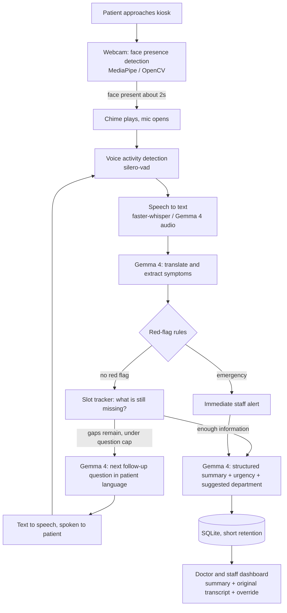
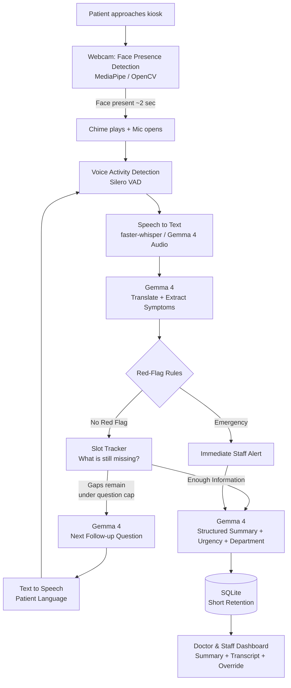
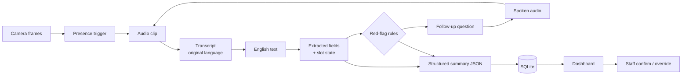

# Patient-Kiosk
# AI Patient Intake Kiosk

**An AI-powered, voice-based patient intake and triage support system**

The AI Patient Intake Kiosk helps patients describe their health problems in their own local language, such as Hindi or Marathi. The system collects basic information by voice, asks a few relevant follow-up questions, identifies possible warning signs, and prepares a structured summary for the doctor.

The purpose of the project is **not to replace doctors**, but to reduce the repetitive work involved in patient registration, history collection, translation, and documentation.

## Table of Contents

1. [Project Name](#1-project-name)
2. [Problem Statement](#2-problem-statement)
3. [Project Overview](#3-project-overview)
4. [Proposed Solution](#4-proposed-solution)
5. [Objectives](#5-objectives)
6. [Target Users / Use Case](#6-target-users--use-case)
7. [Open-Source AI Technology Selected](#7-open-source-ai-technology-selected)
8. [Why This Technology Was Selected](#8-why-this-technology-was-selected)
9. [AI's Role in the System](#9-ais-role-in-the-system)
10. [System Architecture](#10-system-architecture)
11. [Component-Level Architecture](#11-component-level-architecture)
12. [Data / Information Flow](#12-data--information-flow)
13. [Agentic Workflow (if applicable)](#13-agentic-workflow-if-applicable)
14. [Technology Stack](#14-technology-stack)
15. [Expected Features](#15-expected-features)
16. [Implementation Approach](#16-implementation-approach)
17. [Expected Final Output](#17-expected-final-output)
18. [Future Scope / Scalability](#18-future-scope--scalability)
19. [Open-Source Dependencies / Components](#19-open-source-dependencies--components)
20. [Expected Challenges and Mitigation](#20-expected-challenges-and-mitigation)

---

## 1. Project Name

**AI Patient Intake Kiosk**

*An AI-powered, voice-based patient intake and triage support system.*

---

## 2. Problem Statement

In many clinics and hospitals, the first few minutes of a consultation are spent collecting basic information from the patient.

Patients may face difficulty explaining their problems because of:

- Language barriers
- Lack of confidence in speaking English
- Difficulty explaining symptoms clearly
- Repeated questioning by doctors or staff
- Long waiting times
- Dependence on family members for translation

At the same time, doctors and healthcare workers spend significant time asking routine questions such as:

- What is the main problem?
- When did it start?
- How severe is it?
- Are there any other symptoms?
- What medicines are being taken?
- Does the patient have any allergies?

This information is important, but collecting it manually takes time and can result in missing or incomplete information. In a busy clinic, possible emergency symptoms also need to be noticed quickly.

### The problem we are solving

> How can we use AI to collect a patient's basic medical history in their own language, organize the information, identify possible warning signs, and provide a clear summary to the doctor, without replacing human medical judgment?

---

## 3. Project Overview

The AI Patient Intake Kiosk is a smart kiosk placed in a clinic or hospital waiting area. A patient approaches the kiosk and speaks about their health problem.

```
Patient → Voice Input → AI Understanding → Follow-up Questions → Safety Check → Triage Suggestion → Doctor Summary
```

The patient does not need to type long answers or understand complicated medical forms. The system understands supported local languages and converts the conversation into a structured English summary.

### Example

A patient may say in Marathi:

> “मला कालपासून छातीत दुखत आहे आणि श्वास घ्यायला त्रास होत आहे.”

The system can convert this into a structured summary:

| Field | Value |
|---|---|
| Chief Complaint | Chest pain |
| Duration | Since yesterday |
| Associated Symptom | Difficulty breathing |
| Possible Red Flag | Yes |
| Suggested Urgency | Emergency |
| Final Decision | Staff / Doctor |

**The system does not diagnose the disease. It only provides intake and triage support.**

---

## 4. Proposed Solution

We propose a hands-free AI-powered patient intake kiosk that combines voice technology, local-language processing, Gemma 4, safety rules, and a doctor dashboard.

### 4.1 Patient Detection
The kiosk detects when a patient is standing in front of it. The camera is used **only for presence detection**. The system does not perform face recognition.

### 4.2 Voice Interaction
The microphone opens automatically when the patient approaches. The patient can explain their problem naturally without pressing a recording button.

### 4.3 Local-Language Speech Recognition
The patient's speech is converted into text. Supported languages include:

- Hindi
- Marathi
- Other supported Indian languages

The original transcript is also kept so the doctor can verify what the patient actually said.

### 4.4 AI Understanding Using Gemma 4
Gemma 4 helps understand and structure the patient's information. It identifies fields such as:

- Chief complaint
- Duration
- Severity
- Associated symptoms
- Medicines
- Allergies
- Other relevant patient-reported information

### 4.5 Smart Follow-Up Questions
If important information is missing, the system asks a few additional questions, for example:

- “Since when are you experiencing this problem?”
- “How severe is the pain?”
- “Are you currently taking any medicines?”

The number of questions is limited so the patient does not feel they are completing a long questionnaire.

### 4.6 Red-Flag Detection
A rule-based safety layer checks for potentially serious symptoms such as:

- Chest pain
- Severe breathing difficulty
- Fainting
- Heavy bleeding
- Stroke-like symptoms

If a possible red flag is detected, the system can immediately alert the staff.

### 4.7 Triage Suggestion
The system provides a simple urgency suggestion:

| Level | Meaning |
|---|---|
| **Emergency** | Possible immediate attention required |
| **Urgent** | Patient should be attended to quickly |
| **Routine** | Normal consultation flow |

The system can also suggest a department based on the clinic's available departments. Staff can always change or override the suggestion.

### 4.8 Doctor-Ready Summary
After the conversation, the doctor receives a structured summary instead of having to read or listen to the entire conversation. The summary includes:

- Chief complaint
- Duration
- Severity
- Associated symptoms
- Red flags
- Medicines
- Allergies
- Original transcript
- Low-confidence information
- Suggested urgency
- Suggested department

---

## 5. Objectives

1. **Reduce patient intake time:** collect basic patient information before the doctor consultation begins.
2. **Remove language barriers:** allow patients to communicate naturally in their preferred local language.
3. **Reduce the doctor's routine work:** automate repetitive history-taking and basic documentation.
4. **Improve information completeness:** capture important details such as duration, severity, medicines and allergies.
5. **Detect possible emergency symptoms early:** use predefined safety rules to identify red-flag symptoms.
6. **Support patient routing:** suggest the appropriate urgency level and department.
7. **Provide a clear doctor summary:** convert the patient's conversation into a structured, easy-to-read format.
8. **Maintain human control:** doctors and healthcare staff remain responsible for the final decision.
9. **Protect patient privacy:** use local processing wherever possible and follow short data-retention practices.
10. **Improve overall clinic workflow:** reduce unnecessary waiting, repeated questions and documentation work.

### Main objective

> Our goal is to save the doctor's time on routine information collection, reduce language barriers for patients, and provide a safe, structured patient summary, while keeping the doctor in complete control of medical decisions.

---

## 6. Target Users / Use Case

**Problem.** In busy clinics, the first minutes of a consultation are spent on work that is not medical judgment: bridging a language gap between patient and doctor, repeating routine history questions (what, since when, how bad, medicines, allergies), and writing notes. Patients who speak a local language such as Hindi or Marathi are affected most.

**Who it helps**

| User | How they benefit |
|---|---|
| Patients who speak a local language | Describe their problem by voice in their own language and hear follow-up questions spoken back |
| Doctors | Receive a structured English summary with the original transcript, instead of collecting and translating the history themselves |
| Front-desk / triage staff | See a suggested urgency level and department, and get an immediate alert for red-flag symptoms |

**Use case flow.** A patient walks up to the kiosk, the webcam detects their presence, a chime plays and the mic opens. The patient speaks, the system asks a few follow-up questions, and the doctor receives an English clinical summary with a suggested urgency level and department.

**What it is not.** It is an intake and triage-support prototype. It does not diagnose, and a human confirms or overrides every suggestion. It is not a certified medical device.

---

## 7. Open-Source AI Technology Selected

**Core model:** Gemma 4 `[E4B / 26B MoE — confirm after testing]`, an open-weight model released under the Apache 2.0 license, run locally through `[Ollama / llama.cpp / vLLM — confirm]`.

**Supporting open-source components**

| Stage | Component | License |
|---|---|---|
| Presence detection | MediaPipe face detection / OpenCV | `[confirm]` |
| Voice activity detection | silero-vad | `[confirm]` |
| Speech to text | faster-whisper `[and/or Gemma 4 native audio — confirm]` | `[confirm]` |
| Text to speech | `[AI4Bharat Indic-TTS / Indic Parler-TTS / pre-generated audio bank — confirm]` | `[confirm]` |
| Backend and UI | FastAPI, Streamlit | `[confirm]` |
| Storage | SQLite | Public domain |

Project license: `[Apache 2.0 / MIT]`.

---

## 8. Why This Technology Was Selected

- **Runs locally.** Patient speech, summaries and reports stay on the device. No cloud API is used, which matters for sensitive medical data.
- **Open weights, permissive license.** Gemma 4 is released under Apache 2.0, so the project can be freely reproduced and extended.
- **Multimodal.** One model family covers text, images and, on the edge sizes, audio. This lets the same system handle the conversation and, as a stretch feature, existing medical documents.
- **Sizes that fit the hardware.** The smaller edge models run on a laptop for a kiosk, while a larger mixture-of-experts model is available when more quality is needed.
- **Structured output.** The system needs reliable JSON (summary fields, department, urgency) rather than free text, which can be enforced with constrained decoding.
- **Language coverage.** Indian-language support is essential here. `[Add your own test result: e.g. "In our 20-utterance Hindi/Marathi test, E4B produced faithful translations in X/20 cases and valid JSON in Y/20."]`

**Alternatives considered.** `[Briefly note e.g. rules-only intake form, Whisper + a separate LLM, a cloud API, and why Gemma 4 was preferred. Include the baseline comparison numbers if you ran one.]`

---

## 9. AI's Role in the System

Gemma 4 is central to the core workflow. Deterministic rules handle safety-critical decisions.

| Task | Handled by |
|---|---|
| Understand the patient's complaint in a local language and translate it to English | Gemma 4 |
| Decide which fact is missing and generate the next follow-up question in the patient's language | Gemma 4, guided by a slot tracker (onset, duration, severity, associated symptoms, medicines, allergies; max `[3]` questions) |
| Produce the structured clinical summary (JSON) | Gemma 4 with schema-constrained output |
| Suggest a department with a reason and confidence, from the clinic's fixed department list | Gemma 4, with age and pregnancy routing rules and a General Medicine fallback |
| Extract fields from existing reports (stretch feature) | Gemma 4 vision |
| Detect emergencies (chest pain, severe breathing difficulty, fainting, heavy bleeding, stroke-like symptoms) | **Rule layer.** The LLM can escalate urgency but never downgrade it |
| Final decision on routing and care | **Human staff and doctor** |

**Why the AI is necessary.** Patient speech is free-form, multilingual and incomplete. A fixed form or keyword matcher cannot adapt its follow-up questions or translate and structure the answers. `[Add baseline numbers: e.g. completeness of key fields with vs. without follow-ups.]`

**Limits.** The summary is patient-reported and always shown next to the original transcript, with low-confidence fields flagged. The system never states a diagnosis.

---

## 10. System Architecture



**Data flow**

1. **Trigger:** the camera loop detects a face for about 2 seconds, plays a chime and opens the mic. Only presence is detected: no recognition, and no frames are stored.
2. **Capture:** voice activity detection records until the patient stops speaking.
3. **Transcribe:** speech is transcribed in the patient's own language and the original transcript is kept.
4. **Understand:** Gemma 4 translates and extracts symptoms into slots. The rule layer scans for red flags in parallel.
5. **Follow up:** if key facts are missing, Gemma 4 generates one question in the patient's language, which is spoken back via TTS. This repeats up to `[3]` times.
6. **Summarize and route:** Gemma 4 outputs the structured summary, urgency level and suggested department as JSON.
7. **Review:** staff and the doctor see the summary beside the original transcript and can override the routing.

**Summary fields:** chief complaint, duration, severity, associated symptoms, red flags, patient-reported medicines and allergies, original transcript, low-confidence flags, suggested urgency, suggested department with reason.

**Privacy.** All processing is local. Consent is requested before recording. Raw audio and images are deleted after the visit `[confirm your retention rule]`.

**Evaluation.** `[Insert results: scripted Hindi/Marathi scenarios, emergency recall, department accuracy, over-triage rate, summary completeness, and the baseline comparison. Label all results as simulated.]`

**Repository layout** `[adjust to your repo]`

```
/kiosk        presence trigger, VAD, audio capture
/pipeline     ASR, Gemma 4 prompts, slot tracker, red-flag rules, TTS
/dashboard    doctor and staff interface
/eval         scripted scenarios and evaluation scripts
/docs         architecture diagram
```
---

## 6. Target Users / Use Case

**Problem.** In busy clinics, the first minutes of a consultation are spent on work that is not medical judgment: bridging a language gap between patient and doctor, repeating routine history questions (what, since when, how bad, medicines, allergies), and writing notes. Patients who speak a local language such as Hindi or Marathi are affected most.

**Who it helps**

| User | How they benefit |
|---|---|
| Patients who speak a local language | Describe their problem by voice in their own language and hear follow-up questions spoken back |
| Doctors | Receive a structured English summary with the original transcript, instead of collecting and translating the history themselves |
| Front-desk / triage staff | See a suggested urgency level and department, and get an immediate alert for red-flag symptoms |

**Use case flow.** A patient walks up to the kiosk, the webcam detects their presence, a chime plays and the mic opens. The patient speaks, the system asks a few follow-up questions, and the doctor receives an English clinical summary with a suggested urgency level and department.

**What it is not.** It is an intake and triage-support prototype. It does not diagnose, and a human confirms or overrides every suggestion. It is not a certified medical device.

---

## 7. Open-Source AI Technology Selected

**Core model:** Gemma 4 `[E4B / 26B MoE — confirm after testing]`, an open-weight model released under the Apache 2.0 license, run locally through `[Ollama / llama.cpp / vLLM — confirm]`.

**Supporting open-source components**

| Stage | Component | License |
|---|---|---|
| Presence detection | MediaPipe face detection / OpenCV | `[confirm]` |
| Voice activity detection | silero-vad | `[confirm]` |
| Speech to text | faster-whisper `[and/or Gemma 4 native audio — confirm]` | `[confirm]` |
| Text to speech | `[AI4Bharat Indic-TTS / Indic Parler-TTS / pre-generated audio bank — confirm]` | `[confirm]` |
| Backend and UI | FastAPI, Streamlit | `[confirm]` |
| Storage | SQLite | Public domain |

Project license: `[Apache 2.0 / MIT]`.

---

## 8. Why This Technology Was Selected

- **Runs locally.** Patient speech, summaries and reports stay on the device. No cloud API is used, which matters for sensitive medical data.
- **Open weights, permissive license.** Gemma 4 is released under Apache 2.0, so the project can be freely reproduced and extended.
- **Multimodal.** One model family covers text, images and, on the edge sizes, audio. This lets the same system handle the conversation and, as a stretch feature, existing medical documents.
- **Sizes that fit the hardware.** The smaller edge models run on a laptop for a kiosk, while a larger mixture-of-experts model is available when more quality is needed.
- **Structured output.** The system needs reliable JSON (summary fields, department, urgency) rather than free text, which can be enforced with constrained decoding.
- **Language coverage.** Indian-language support is essential here. `[Add your own test result: e.g. "In our 20-utterance Hindi/Marathi test, E4B produced faithful translations in X/20 cases and valid JSON in Y/20."]`

**Alternatives considered.** `[Briefly note e.g. rules-only intake form, Whisper + a separate LLM, a cloud API, and why Gemma 4 was preferred. Include the baseline comparison numbers if you ran one.]`

---

## 9. AI's Role in the System

Gemma 4 is central to the core workflow. Deterministic rules handle safety-critical decisions.

| Task | Handled by |
|---|---|
| Understand the patient's complaint in a local language and translate it to English | Gemma 4 |
| Decide which fact is missing and generate the next follow-up question in the patient's language | Gemma 4, guided by a slot tracker (onset, duration, severity, associated symptoms, medicines, allergies; max `[3]` questions) |
| Produce the structured clinical summary (JSON) | Gemma 4 with schema-constrained output |
| Suggest a department with a reason and confidence, from the clinic's fixed department list | Gemma 4, with age and pregnancy routing rules and a General Medicine fallback |
| Extract fields from existing reports (stretch feature) | Gemma 4 vision |
| Detect emergencies (chest pain, severe breathing difficulty, fainting, heavy bleeding, stroke-like symptoms) | **Rule layer.** The LLM can escalate urgency but never downgrade it |
| Final decision on routing and care | **Human staff and doctor** |

**Why the AI is necessary.** Patient speech is free-form, multilingual and incomplete. A fixed form or keyword matcher cannot adapt its follow-up questions or translate and structure the answers. `[Add baseline numbers: e.g. completeness of key fields with vs. without follow-ups.]`

**Limits.** The summary is patient-reported and always shown next to the original transcript, with low-confidence fields flagged. The system never states a diagnosis.

---

## 10. System Architecture



**Data flow**

1. **Trigger:** the camera loop detects a face for about 2 seconds, plays a chime and opens the mic. Only presence is detected: no recognition, and no frames are stored.
2. **Capture:** voice activity detection records until the patient stops speaking.
3. **Transcribe:** speech is transcribed in the patient's own language and the original transcript is kept.
4. **Understand:** Gemma 4 translates and extracts symptoms into slots. The rule layer scans for red flags in parallel.
5. **Follow up:** if key facts are missing, Gemma 4 generates one question in the patient's language, which is spoken back via TTS. This repeats up to `[3]` times.
6. **Summarize and route:** Gemma 4 outputs the structured summary, urgency level and suggested department as JSON.
7. **Review:** staff and the doctor see the summary beside the original transcript and can override the routing.

**Summary fields:** chief complaint, duration, severity, associated symptoms, red flags, patient-reported medicines and allergies, original transcript, low-confidence flags, suggested urgency, suggested department with reason.

**Privacy.** All processing is local. Consent is requested before recording. Raw audio and images are deleted after the visit `[confirm your retention rule]`.

**Evaluation.** `[Insert results: scripted Hindi/Marathi scenarios, emergency recall, department accuracy, over-triage rate, summary completeness, and the baseline comparison. Label all results as simulated.]`

**Repository layout** `[adjust to your repo]`

```
/kiosk        presence trigger, VAD, audio capture
/pipeline     ASR, Gemma 4 prompts, slot tracker, red-flag rules, TTS
/dashboard    doctor and staff interface
/eval         scripted scenarios and evaluation scripts
/docs         architecture diagram
```
## 11. Component-Level Architecture

The system is split into independent modules, so each stage can be tested, replaced or improved without touching the others.

| # | Component | Responsibility | Input → Output | Technology |
|---|---|---|---|---|
| 1 | Presence Detector | Detects a patient standing at the kiosk for about 2 seconds, then triggers the chime and mic. Presence only, no recognition, no stored frames | Camera frames → trigger signal | MediaPipe / OpenCV |
| 2 | Audio Capture + VAD | Records speech and detects when the patient starts and stops speaking | Microphone stream → audio clip | Silero VAD |
| 3 | Speech-to-Text | Transcribes speech in the patient's own language and keeps the original transcript | Audio clip → transcript + detected language | faster-whisper `[or Gemma 4 audio — confirm]` |
| 4 | Language Handler | Translates to English where needed | Transcript → English text | Gemma 4, IndicTrans2 as fallback `[confirm]` |
| 5 | Gemma 4 Reasoning Engine | Extracts symptoms into fields, generates follow-up questions, writes the structured summary and department suggestion | Text + slot state → JSON / next question | Gemma 4 via Ollama / llama.cpp |
| 6 | Slot Tracker | Tracks which facts are known (complaint, duration, severity, associated symptoms, medicines, allergies) and which are missing | Extracted fields → missing-slot list | Python |
| 7 | Red-Flag Rule Engine | Deterministic emergency check. Can raise urgency, never lower it | Text + fields → alert / no alert | Python rules |
| 8 | Triage Module | Combines rules and Gemma 4 output into an urgency level and suggested department | Fields + flags → urgency + department | Python + Gemma 4 |
| 9 | Text-to-Speech | Speaks follow-up questions in the patient's language | Question text → audio | AI4Bharat Indic-TTS `[or pre-generated audio bank]` |
| 10 | Backend API | Connects all modules and serves the dashboard | HTTP requests → JSON | FastAPI |
| 11 | Storage | Stores summaries with a short retention period | JSON → records | SQLite |
| 12 | Doctor / Staff Dashboard | Shows the patient queue, summary, original transcript, and confirm / override controls | Records → UI | Streamlit / Gradio |

---

## 12. Data / Information Flow



| Stage | Data | Notes |
|---|---|---|
| Capture | Camera frames, audio | Frames are not stored; raw audio is deleted after the visit `[confirm retention rule]` |
| Transcription | Original-language transcript | Kept so the doctor can verify what the patient said |
| Understanding | English text, extracted fields | Gemma 4 maps free speech to fixed fields |
| Safety check | Red-flag result | Runs on every turn, independent of the LLM |
| Follow-up | Question text → audio | Capped at `[3]` questions |
| Output | Summary JSON | Validated against a schema before display |
| Review | Staff decision | Override is recorded alongside the AI suggestion |

**Example summary output**

```json
{
  "patient_id": "001",
  "language": "Hindi",
  "chief_complaint": "Chest pain",
  "duration": "Since yesterday",
  "severity": "Severe",
  "associated_symptoms": ["Shortness of breath"],
  "medicines": [],
  "allergies": [],
  "red_flags": ["Chest pain + breathing difficulty"],
  "suggested_urgency": "Emergency",
  "suggested_department": "[department]",
  "low_confidence_fields": [],
  "original_transcript": "[stored]",
  "staff_decision": null
}
```

---

## 13. Agentic Workflow (if applicable)

The system has a **bounded agentic loop**, not an autonomous agent. Gemma 4 decides what to ask next, but a controller with fixed rules decides when to stop and what it is allowed to do.

```
loop (max [3] follow-up questions):
    1. Transcribe the patient's reply
    2. Gemma 4 extracts fields and updates the slot tracker
    3. Red-flag rules scan the text      → alert staff immediately if triggered
    4. If key slots are missing:
           Gemma 4 picks the most important gap and writes one question
           Question is spoken in the patient's language
           repeat
       Else: exit loop
generate structured summary, urgency and department suggestion
staff confirm or override
```

| Element | Role in the workflow |
|---|---|
| Decision maker | Gemma 4 chooses which missing fact to ask about and phrases the question |
| Tools it can use | Slot tracker, red-flag rule engine, TTS, summary generator |
| Guardrails | Question cap, schema-constrained JSON, rule layer that can escalate but never downgrade urgency |
| Human in the loop | Staff and doctor confirm or override every suggestion |
| What it cannot do | Diagnose, prescribe, or make final routing decisions |

---

## 14. Technology Stack

| Layer | Technology |
|---|---|
| Core AI model | Gemma 4 `[E4B / 26B MoE — confirm after testing]` |
| Model serving | Ollama / llama.cpp (quantized, local) |
| Structured output | JSON Schema / Outlines |
| Presence detection | MediaPipe, OpenCV |
| Voice activity detection | Silero VAD |
| Speech-to-text | faster-whisper `[or Gemma 4 native audio]` |
| Translation | Gemma 4, IndicTrans2 (fallback) |
| Text-to-speech | AI4Bharat Indic-TTS `[or pre-generated audio bank]` |
| Backend | Python, FastAPI |
| Interface | Streamlit / Gradio |
| Storage | SQLite |
| Version control | GitHub, license `[Apache 2.0 / MIT]` |

---

## 15. Expected Features

### Core features
- **Presence trigger:** face detection opens the mic with a chime, no face recognition
- **Hands-free speech capture:** no record button needed
- **Local-language input:** Hindi, Marathi and other supported Indian languages, with the original transcript retained
- **Translation and structuring:** patient speech converted into English clinical fields
- **Slot-based follow-up questions:** a limited number of questions for missing details, spoken back in the patient's language
- **Red-flag detection:** deterministic rules for chest pain, severe breathing difficulty, fainting, heavy bleeding and stroke-like symptoms, with an immediate staff alert
- **Triage suggestion:** urgency level (Emergency, Urgent, Routine) and a suggested department
- **Doctor-ready summary:** complaint, duration, severity, associated symptoms, red flags, medicines, allergies, original transcript and low-confidence flags
- **Staff dashboard:** patient queue, summary view, and confirm / override controls

### Stretch features
- **Existing report ingestion:** Gemma 4 vision extracts dates, test values, units and medicine names from prescriptions and lab reports, with no medical interpretation
- **Consent and privacy controls:** consent prompts, configurable retention and automatic deletion of temporary audio and images

> The system supports intake and triage only. It does not diagnose, and a human makes every final decision.
## 16. Implementation Approach

The implementation follows an **incremental pipeline** rather than attempting to build the entire system at once.

### Phase 1: Basic Interaction
- Face presence detection
- Voice activation
- Audio capture

### Phase 2: Speech Pipeline
- Speech-to-text
- Local-language processing
- Testing Hindi/Marathi input

### Phase 3: Gemma 4 Integration
- Prompt design
- Information extraction
- Follow-up question generation
- Structured JSON output

### Phase 4: Safety & Triage
- Red-flag rules
- Slot tracking
- Urgency classification
- Department recommendation

### Phase 5: Dashboard
- Patient queue
- Summary display
- Original transcript
- Staff override

### Phase 6: Testing
Test using scripted patient scenarios and measure:
- Translation quality
- Follow-up quality
- Structured-output validity
- Red-flag detection
- Summary completeness

> The development plan prioritizes the **end-to-end core flow** before optional features.

---

## 17. Expected Final Output

The final prototype is expected to provide a working patient-intake demonstration.

### Patient Side

```
        AI PATIENT INTAKE KIOSK

          नमस्ते! / Hello!

   Please describe your problem
      in your preferred language.

          🎙 Listening...
```

### Doctor Side

```
PATIENT #001

Urgency:             EMERGENCY
Department:          General Medicine
Chief Complaint:     Chest pain
Duration:            Since yesterday
Severity:            Severe
Associated Symptoms: Shortness of breath
Red Flags:           Chest pain + breathing difficulty
Patient Language:    Hindi
Original Transcript: [Available]
AI Recommendation:   Immediate staff assessment required.

[CONFIRM]   [OVERRIDE]
```

> The final output is intended to **assist medical staff, not replace their judgment**.

---

## 18. Future Scope / Scalability

### Existing Report Ingestion
Patients could show or upload:
- Previous prescriptions
- Laboratory reports
- Medical documents

Gemma 4 vision/OCR-based processing could extract information such as dates, test values, units and medicine names. **No medical interpretation would be performed.**

### Consent & Privacy Controls
Future versions will introduce:
- Explicit consent before recording
- Consent before document scanning
- Configurable data retention
- Automatic deletion of temporary audio/images
- Stronger access control

### Other Future Extensions
- More Indian languages
- Hospital-specific department configuration
- Larger-scale deployment
- Improved multilingual speech models
- Integration with hospital information systems
- Analytics for clinic workflow
- More advanced dashboard architecture

---

## 19. Open-Source Dependencies / Components

The project is designed around open-source AI and software components.

### AI / ML

| Component | Role |
|---|---|
| Gemma 4 | Understanding, follow-up questions, structured summary |
| faster-whisper | Speech-to-text |
| MediaPipe | Face presence detection |
| Silero VAD | Voice activity detection |
| IndicTrans2 | Indian-language translation |
| AI4Bharat Indic-TTS | Local-language text-to-speech |

### Development

| Component | Role |
|---|---|
| Python | Core language |
| FastAPI | Backend |
| Streamlit / Gradio | Dashboard and kiosk interface |
| SQLite | Storage |
| Ollama / llama.cpp | Local model inference |
| JSON Schema / Outlines | Structured output |

---

## 20. Expected Challenges and Mitigation

| Challenge | Mitigation |
|---|---|
| Hindi/Marathi speech recognition quality | Test speech models early using representative utterances |
| AI hallucination | Constrained JSON output + validation |
| Incorrect medical decisions | AI restricted to intake/triage support |
| Missed emergency | Deterministic red-flag rules |
| False emergency alerts | Track over-triage rate |
| Slow local inference | Quantized models and optimized runtimes |
| Poor TTS quality | AI4Bharat TTS / pre-generated audio fallback |
| Missing patient information | Slot-based follow-up questions |
| AI recommendation errors | Human confirmation/override |
| Uncertain AI output | Prioritize core end-to-end workflow |
